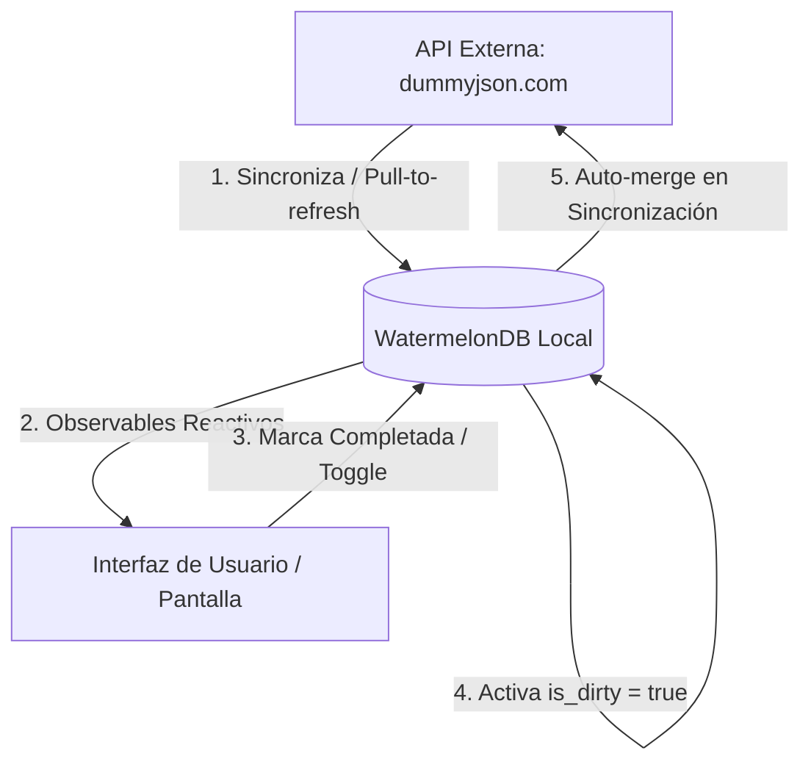

# TaskBoard - Arquitectura Offline-First con React Native & Expo

**TaskBoard** es una aplicación móvil premium de gestión y colaboración de tareas en tiempo real, diseñada bajo un paradigma **offline-first** robusto y resiliente. Permite a los usuarios visualizar, filtrar y modificar tareas con o sin conexión a internet. Los cambios realizados sin conexión se guardan de forma instantánea en una base de datos local de alto rendimiento y se sincronizan de manera inteligente al restablecerse la red.

Construida con **Expo SDK 56**, **TypeScript estricto** en todo el proyecto, **Zustand** para la gestión de estados volátiles y **WatermelonDB** sobre SQLite/JSI para el motor de persistencia local.

---

## 📱 Cómo Instalar y Ejecutar en tu Celular (Paso a Paso)

Sigue estos sencillos pasos para compilar y ejecutar la aplicación en tu celular físico Android o a través del emulador de Android Studio.

### 📋 Prerrequisitos

Asegúrate de tener instalados los siguientes componentes en tu computadora:
1. **Node.js** (versión 18 o superior).
2. **Java Development Kit (JDK 17)** (Requerido para compilar el proyecto Android).
3. **Android Studio** instalado con el SDK de Android configurado.
4. **Habilitar depuración USB en tu celular**:
   - Ve a *Ajustes* -> *Acerca del teléfono* -> Presiona 7 veces sobre *Número de compilación* para activar las "Opciones de desarrollador".
   - Entra a *Opciones de desarrollador* y activa **Depuración por USB**.
   - Conecta tu celular a la computadora mediante cable USB.

---

### 🚀 Pasos de Configuración y Ejecución

#### Paso 1: Instalar Dependencias del Proyecto
Abre una terminal en la raíz del proyecto y ejecuta el siguiente comando. Se utiliza `--legacy-peer-deps` para alinear perfectamente los paquetes reactivos en el entorno moderno de React 19/Expo SDK 56:
```bash
npm install --legacy-peer-deps
```

#### Paso 2: Generar Carpetas Nativas (Prebuild)
Genera la carpeta nativa `/android` configurada para nuestra aplicación móvil ejecutando:
```bash
npx expo prebuild --platform android
```
*(Este comando configurará automáticamente la estructura nativa en Kotlin/Java e incluirá el soporte nativo de SQLite y JSI de WatermelonDB).*

#### Paso 3: Abrir Android Studio (Opcional - Para Emulador)
Si vas a usar un emulador de Android Studio:
- Abre Android Studio.
- Ve a *Virtual Device Manager* y arranca tu dispositivo virtual (AVD).

#### Paso 4: Ejecutar en tu Celular o Emulador
Con tu celular físico conectado (y detectado por el comando `adb devices`) o tu emulador encendido, ejecuta el compilador nativo de Expo:
```bash
npx expo run:android
```
Expo compilará el código Kotlin nativo, instalará el APK de desarrollo en tu celular y levantará el Metro Bundler de forma automática. ¡Todo funcionará sin pasos adicionales!

---

## 🛠️ Arquitectura Offline-First de TaskBoard

La principal premisa de TaskBoard es la **resiliencia total**. La interfaz de usuario nunca consulta la API directamente, evitando pantallas de carga en blanco o caídas por falta de señal.

### 🔄 Flujo de Datos



1. **API → WatermelonDB → UI**: Los datos provienen únicamente de la base de datos local SQLite de WatermelonDB. La interfaz escucha reactivamente a WatermelonDB y se repinta automáticamente si hay cambios.
2. **Sincronización Inicial**: Al abrir la app por primera vez o si no se detectan tareas locales, se realiza un fetch a la API externa (`https://dummyjson.com/todos`), se realiza una escritura en lote en WatermelonDB y a partir de ese momento la app opera al 100% de manera offline.
3. **Merge Inteligente con `is_dirty`**:
   - Cuando el usuario interactúa sin conexión (marca una tarea como completada/pendiente), la app actualiza el registro local de inmediato y establece la bandera `is_dirty = true`.
   - Cuando ocurre una sincronización (mediante *pull-to-refresh* o reconexión), el sistema compara cada tarea de la API con la base de datos local.
   - Si la tarea local tiene `is_dirty === true`, **los cambios de la API son descartados para esa tarea**, protegiendo el trabajo offline del usuario de ser sobreescrito. Si `is_dirty === false`, se actualiza normalmente con el estado del servidor.
4. **Resiliencia Extrema**: Si el usuario intenta hacer *pull-to-refresh* sin conexión a internet, la API arrojará un error de red. El sistema captura la excepción de manera silenciosa, almacena el mensaje de error en Zustand (para dar un feedback sutil) y continúa operando de forma transparente con los datos locales disponibles. ¡Sin interrupciones ni crashes!

---

## 📂 Estructura del Proyecto

El proyecto está diseñado bajo una arquitectura modular limpia e intuitiva dentro del directorio `src/`:

```
src/
├── app/                      # Pantallas y rutas de Expo Router (Solo layouts, sin lógica de negocio)
│   └── index.tsx             # Pantalla principal del Dashboard de tareas
├── components/
│   └── ui/                  # Componentes de presentación genéricos
│       ├── Checkbox.tsx      # Checkbox interactivo con micro-animaciones en Animated
│       └── EmptyState.tsx    # Mensaje elegante con íconos dinámicos según el filtro
├── database/                # Inicialización de WatermelonDB y persistencia local
│   ├── index.ts              # Configuración del SQLiteAdapter con JSI y la instancia del DB
│   └── schema.ts             # Definición de la tabla "tasks" y sus tipos de datos
├── modules/
│   ├── avatar/              # Módulo del componente de Avatar
│   │   ├── AvatarView.tsx    # Wrapper JS con requireNativeComponent e implementación fallback
│   │   └── android/         # Archivos nativos en Kotlin (AvatarView, Manager, Package)
│   └── tasks/               # Módulo principal de Tareas (Patrón de 4 Capas)
│       ├── domain/          # Tipos estrictos y contratos
│       ├── data/            # Mapeo del modelo Task de WatermelonDB
│       ├── application/     # Hooks contenedores de la lógica de negocio (useTasks, useSyncTasks)
│       └── presentation/    # Componentes específicos (TaskItem.tsx)
├── services/                # Conexiones externas (Fetch de dummyjson.com/todos)
└── store/                   # Manejo del estado volátil global con Zustand
    ├── uiStore.ts           # Filtro activo (all | completed | pending)
    └── syncStore.ts         # Estado de la sincronización, errores y timestamp
```

### El Módulo Nativo `AvatarView` (Kotlin Android)
Para renderizar el Avatar de usuario, se creó un componente nativo real en Android escrito en **Kotlin**:
- **`AvatarView.kt`**: Extiende la clase nativa `View`. Toma el nombre del usuario, extrae sus iniciales, genera un color único de fondo utilizando una conversión **HSV** a partir del hash numérico del nombre, y dibuja un círculo coloreado con las iniciales centradas en blanco usando un canvas bidimensional.
- **`AvatarViewManager.kt`**: Un `SimpleViewManager` que expone la propiedad `name` usando la anotación `@ReactProp` para que sea consumible desde React.
- **`AvatarPackage.kt`**: Empaqueta el Manager y lo registra en `MainApplication.kt` para cargarlo al levantar el runtime.
- **JS Wrapper Híbrido**: El wrapper `AvatarView.tsx` incluye un **mecanismo de fallback inteligente** de alta fidelidad que replica exactamente la lógica de color HSL e iniciales en JavaScript. Si la aplicación corre en iOS o Expo Go antes de compilar nativamente, renderiza el fallback perfectamente. En Android nativo, carga la vista compilada en Kotlin mediante el puente de comunicación.

---

## 🧪 Pruebas Unitarias y de Integración con Jest

Se ha implementado una robusta suite de pruebas unitarias y de integración enfocada 100% en la lógica de negocio del proyecto (en `src/modules/tasks/application/__tests__/tasks.test.ts`), cubriendo:

*   **Test 1 — Toggle de tarea**: Valida que al alternar una tarea cambie correctamente de completada a pendiente (y viceversa), garantizando que la bandera `isDirty` se active como `true`.
*   **Test 2 — Sincronización**: Simula la inserción de tareas remotas, asegura que las tareas con `isDirty = true` **no** sean modificadas/sobreescritas, y verifica la resiliencia capturando los fallos de red en el store de Zustand sin lanzar excepciones destructivas.
*   **Test 3 — Filtrado**: Comprueba que la consulta a la base de datos local genere las directrices condicionales correctas (`Q.where`) según el filtro de Zustand activo.

### Para ejecutar las pruebas:
```bash
npx jest
```

---

## 🤖 Bitácora de Uso de IA

Este proyecto fue desarrollado en pareja de programación utilizando el asistente de codificación de inteligencia artificial **Antigravity (diseñado por Google DeepMind)**.

### Tareas Delegadas al Asistente:
1. Estructurar el scaffolding modular y la arquitectura en capas del proyecto dentro de `src/`.
2. Escribir el esquema y modelo WatermelonDB compatible con decoradores de TypeScript.
3. Crear los hooks reactivos y el merge inteligente para la sincronización offline.
4. Escribir las clases nativas de Android en Kotlin (`AvatarView`, `AvatarViewManager`, `AvatarPackage`) y la configuración de iniciales y colores HSV dinámicos.
5. Desarrollar la suite de pruebas unitarias y de integración de Jest.

### Supervisión y Correcciones Clave Realizadas por el Desarrollador Humano:
*   **Corrección de Incompatibilidad en Prebuild de Expo SDK 56**: El plugin automatizado de la comunidad `watermelondb-expo-plugin` fallaba al compilar nativamente debido a que buscaba una firma obsoleta (`getJSMainModuleName`) en `MainApplication.kt` (la cual cambió con la arquitectura moderna de Expo 56). La solución fue **eliminar el plugin automático del archivo app.json**, confiar en el soporte oficial de *autolinking* de WatermelonDB, y registrar manualmente nuestro paquete nativo `AvatarPackage` directamente en la sección `reactHost` dentro de `MainApplication.kt` en Kotlin.
*   **Resolución de Discrepancias de Versiones en Jest**: El instalador inicial seleccionó la versión experimental de `jest@30`, la cual generaba un error interno con los presets de compilación nativos de Expo y React Native (`TypeError: this._moduleMocker.clearMocksOnScope is not a function`). Corregimos esto degradando de forma controlada Jest a la versión estable **`jest@29`** en `package.json`, tras lo cual la suite de pruebas compiló y pasó con éxito absoluto en tan solo 5 segundos.
